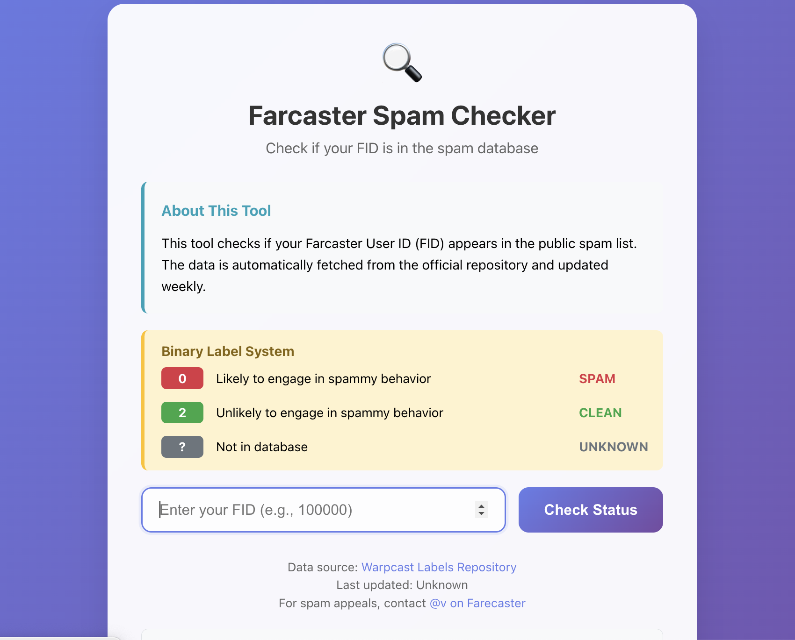

# Farcaster Spam Checker

Simple tool to check if your FID is flagged in Farcaster's spam database.



**Data Source:** [warpcast/labels](https://github.com/warpcast/labels) - Warpcast's official spam labels repository

## Important

This tool downloads data from Farcaster's servers. Please use it responsibly - don't create high-traffic public instances or remove the rate limits.

## Quick Start

### Local Server (Recommended)
```bash
git clone https://github.com/bernie-developer/farcaster-spam-checker.git
cd farcaster-spam-checker

# Start a local server:
python -m http.server 8000    # Python
npx serve .                   # Node.js
php -S localhost:8000         # PHP 

# Open http://localhost:8000
```

### Deploy to Hosting Platform
Upload to Netlify, Vercel, your Cloud Server, VPS, or any web hosting service.

### CORS Limitation
Opening `index.html` directly in your browser (file:// protocol) won't work due to CORS restrictions. You need to run it through a web server.

## Features

- Checks FID against Farcaster's public spam data from [warpcast/labels](https://github.com/warpcast/labels)
- Shows current binary labels (0=spam, 2=clean)
- Built-in rate limiting (10 checks per day, 3 second cooldown)
- Works entirely in browser, no backend needed
- Uses githubusercontent as primary source with AllOrigins proxy fallback

## Rate Limits

The tool limits usage to respect Farcaster's bandwidth:
- 10 searches per day per user
- 3 second cooldown between searches

You can adjust these in the code if needed for your use case.

## Usage Guidelines

**Appropriate use:**
- Personal FID checking
- Small team use
- Educational purposes
- Integrating into your own projects

**Please avoid:**
- High-traffic public instances
- Bulk automated checking
- Removing rate limits entirely
- Commercial use without permission

## Customization

Edit `index.html` to modify:
- Rate limits: Look for `DAILY_LIMIT` and `CHECK_COOLDOWN`
- Styling: Modify the CSS in the `<style>` section
- Text: Update HTML content as needed

## Project Structure

```
farcaster-spam-checker/
├── index.html          # The complete tool
├── README.md          # This file
└── LICENSE            # Creative Commons BY-NC 4.0
```

## Contributing

Found a bug or want to improve something? Open an issue or submit a pull request.

## License

Creative Commons Attribution-NonCommercial 4.0 International License

You can use and modify this for personal and educational purposes. Attribution required. Commercial use is not permitted.

## Disclaimers

- Unofficial tool, not affiliated with Farcaster
- Data sourced from [Warpcast Labels Repository](https://github.com/warpcast/labels)
- Farcaster updates spam labels weekly
- For spam appeals, contact @v on Warpcast
- Use at your own risk

## Contact

Questions or issues?
- Open a GitHub issue
- Find me [@holland](https://farcaster.xyz/holland) on Farcaster
- Visit my [website](https://bernie-builds.netlify.app/)
